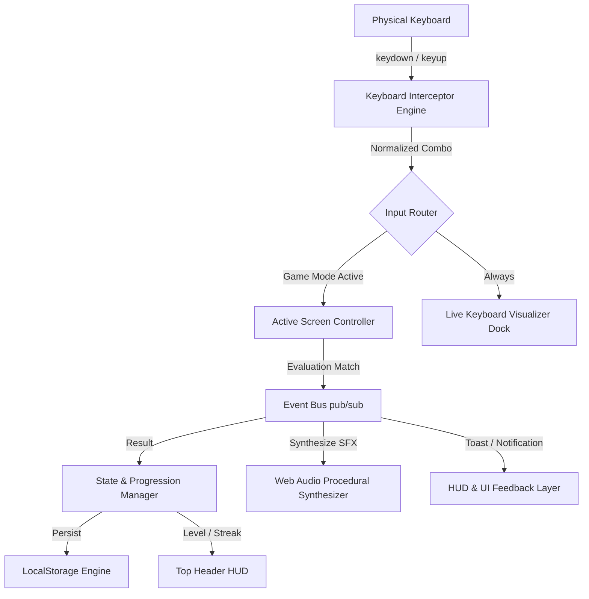
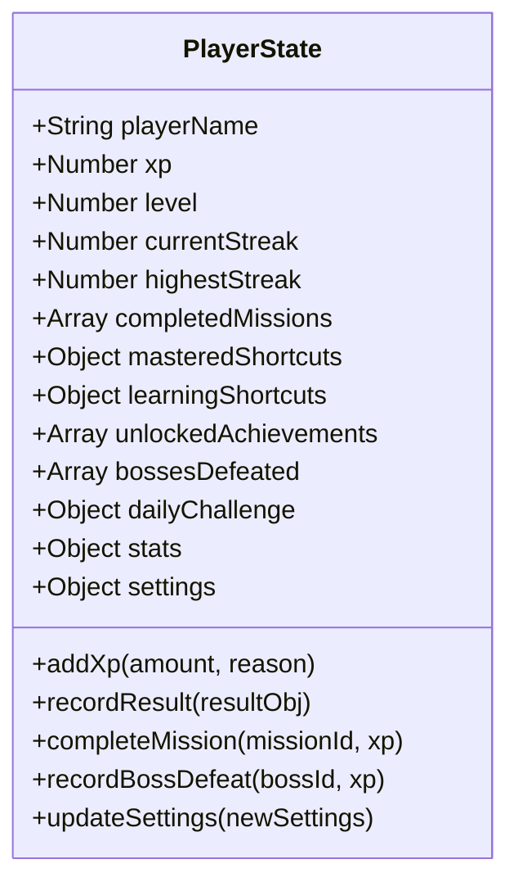
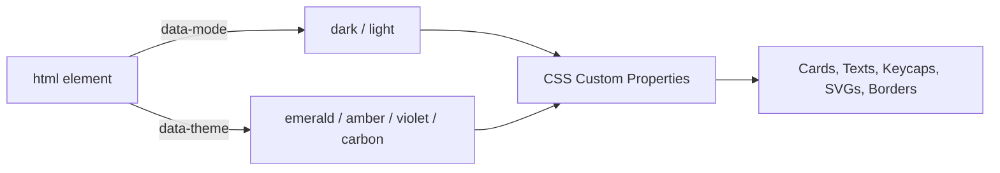
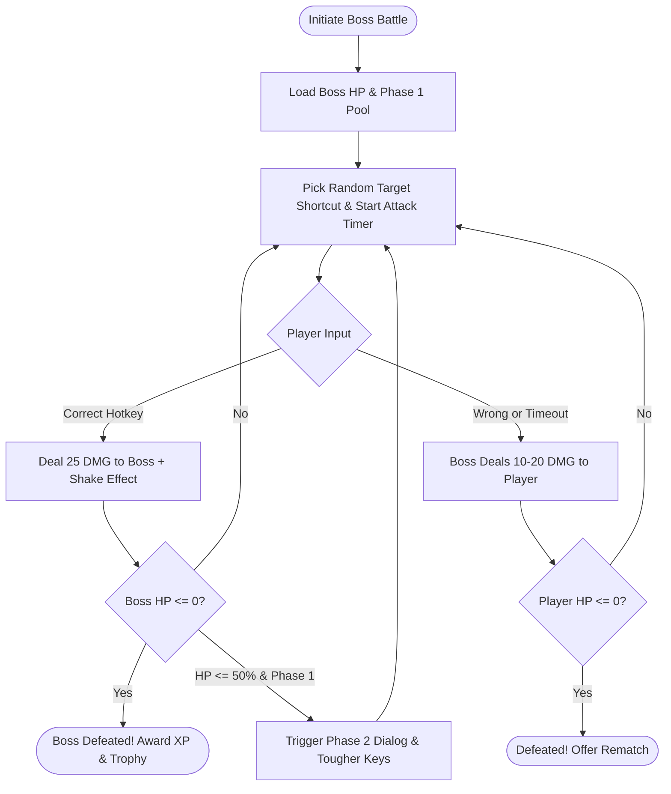

# SHORTCUT MASTER — SYSTEM ARCHITECTURE & DESIGN BLUEPRINT

> **Project Name:** Shortcut Master  
> **Platform:** Modern Web Browsers (Chrome, Edge, Firefox, Brave, Safari)  
> **Architecture Pattern:** Pure Vanilla ES6 Modules + Event-Driven Reactive Bus + CSS Custom Property Theme Engine  
> **Zero External Dependencies:** Built with native Web APIs (KeyboardEvents, Web Audio API, Web Storage API, SVG Vectors)

---

## 1. Executive Summary & Core Philosophy

**Shortcut Master** is a desktop-first, highly responsive browser game engineered to transform passive keyboard shortcut learning into reflexive physical muscle memory. 

Unlike conventional quizzes, flashcards, or multiple-choice questions (MCQs), Shortcut Master requires players to physically press actual key combinations on their keyboard in real-time. The game listens to native DOM keyboard events, suppresses default browser interceptions (e.g., preventing `Ctrl+S` from opening the browser save dialog), updates a dynamic on-screen visualizer, and scores player accuracy, combo streaks, and reaction speed in milliseconds.



---

## 2. High-Level Architecture & Component Decomposition

The application follows a strictly decoupled modular architecture:

```
keen-darwin/
├── index.html                   # Master single-page app shell, HUD header & keyboard visualizer dock
├── BLUEPRINT.md                 # Complete project architectural blueprint
├── css/
│   ├── main.css                 # Base resets, typography, layout grid, HUD & toast styles
│   ├── game.css                 # Mode-specific layouts, cards, timer bars, drills, responsive grids
│   ├── keyboard.css             # Physical keycap visualizer, key layout matrix, active press glow
│   ├── boss.css                 # Boss battle stage, health meters, damage numbers, phase bubbles
│   └── themes.css               # Color tokens for Dark Mode & Light Mode across 4 palette accents
├── js/
│   ├── app.js                   # Application coordinator, screen router, HUD updates, modal controller
│   ├── engine/
│   │   ├── bus.js               # Decoupled publish/subscribe event emitter
│   │   ├── state.js             # Player state, XP curves, streaks, daily quests, localStorage sync
│   │   ├── keyboard.js          # DOM key event listener, normalization, modifier tracking & visualizer
│   │   ├── audio.js             # Web Audio API procedural sound synthesizer (Zero audio files)
│   │   └── icons.js             # Handcrafted SVG vector icon library & boss crest emblems
│   ├── data/
│   │   ├── shortcuts.js         # 80+ shortcuts across 7 categories with real-world scenarios & tips
│   │   ├── missions.js          # 40+ scenario-based missions across 5 progressive chapters
│   │   ├── bosses.js            # 4 multi-phase boss encounters, taunts, phases, and damage thresholds
│   │   └── achievements.js      # 16 unlockable achievement criteria with dynamic rule checks
│   └── modes/
│       ├── home.js              # Player overview dashboard, stats strip, daily quest, quick launch
│       ├── learn.js             # Searchable shortcut database with interactive try-it sandbox
│       ├── practice.js          # Free drill practice mode with category filters & hint reveals
│       ├── missions.js          # Real-world scenario campaign runner with simulated outputs
│       ├── speed.js             # 15s / 30s / 60s fast-paced reaction time trials with combo scoring
│       ├── survival.js          # 3-Lives endurance mode with accelerating question timers
│       ├── memory.js            # Flash & Recall and Blind Execution memory drills
│       ├── boss.js              # Turn-based active combat against Keyboard Nemeses
│       ├── achievements.js      # 16 trophies gallery with live completion meters
│       ├── progress.js          # Detailed statistics, category breakdown bars, lifetime metrics
│       ├── settings.js          # Audio volume, Light/Dark appearance mode, accents, data reset
│       └── help.js              # Technical documentation & browser limitation guide
└── shortcut-master.zip          # Packaged production distribution archive
```

---

## 3. Subsystem Technical Deep Dive

### 3.1 Physical Keyboard Interceptor (`js/engine/keyboard.js`)

The keyboard subsystem intercepts physical keystrokes and abstracts OS variations:

* **State Tracking:** Maintains a persistent `Set` of active pressed physical keys (`activeKeys`), refreshed synchronously on `keydown` and `keyup`.
* **Window Blur Resilience:** Automatically clears all active keys on `window.blur` to avoid sticky modifier keys when switching windows with `Alt+Tab`.
* **Browser Hotkey Interception (`preventDefault`):** Intercepts destructive or disruptive hotkeys (`Ctrl+S`, `Ctrl+F`, `Ctrl+P`, `Ctrl+W`, `Ctrl+T`, `Ctrl+B`, `Ctrl+I`, `Ctrl+U`, `Ctrl+A`, `Ctrl+Z`, `Ctrl+Y`) during active gameplay to ensure smooth immersion.
* **Key Normalization Matrix:** Unifies key differences across keyboards:
  * `KeyS` / `s` / `S` $\rightarrow$ `'s'`
  * `ControlLeft` / `ControlRight` $\rightarrow$ `'ctrl'`
  * `ShiftLeft` / `ShiftRight` $\rightarrow$ `'shift'`
  * `AltLeft` / `AltRight` $\rightarrow$ `'alt'`
  * `MetaLeft` / `MetaRight` / `OSLeft` $\rightarrow$ `'win'`
  * `Space` $\rightarrow$ `'space'`
  * `Escape` $\rightarrow$ `'esc'`
* **Matching Algorithm:** Evaluates whether active modifiers and physical keys match the target shortcut definition regardless of the physical order in which keys were depressed.
* **OS-Level Limitations Handling:** Certain combinations (`Win+L`, `Ctrl+Alt+Del`) are captured by the OS kernel before reaching the browser. These shortcuts are tagged with `isRestricted: true` in `shortcuts.js` and displayed with dedicated technical explanations so players learn them without browser crash frustration.

---

### 3.2 Procedural Audio Synthesizer (`js/engine/audio.js`)

Zero external MP3/WAV files. All sound effects are generated mathematically using the native `AudioContext` and procedural oscillators:

| Sound Effect | Waveform | Frequency Progression | Envelope Duration | Purpose |
| :--- | :--- | :--- | :--- | :--- |
| **Correct** | Sine | $523.25\text{ Hz (C5)} \rightarrow 659.25\text{ Hz (E5)}$ | $180\text{ ms}$ | Immediate positive reinforcement |
| **Wrong** | Sawtooth | $140\text{ Hz} \rightarrow 90\text{ Hz}$ | $220\text{ ms}$ | Soft error buzz without harsh distortion |
| **Combo Chord** | Triangle | Multi-note arpeggio ($523\text{ Hz} \rightarrow 1046\text{ Hz}$) | $350\text{ ms}$ | Escalating harmonic fanfare for streaks |
| **Level Up** | Sine / Triangle | 4-tone ascending triad ($440 \rightarrow 554 \rightarrow 659 \rightarrow 880\text{ Hz}$) | $600\text{ ms}$ | Milestone reward |
| **Boss Hit** | Square + Lowpass | Pitch drop $260\text{ Hz} \rightarrow 50\text{ Hz}$ | $250\text{ ms}$ | Heavy arcade impact punch |
| **Boss Defeat** | Triangle Chords | Ascending orchestral arpeggio | $1200\text{ ms}$ | Victory resolution |
| **Danger Tick** | Square | $880\text{ Hz} \rightarrow 440\text{ Hz}$ short pulse | $40\text{ ms}$ | Countdown urgency in Speed & Survival |

*Audio contexts initialize on user gesture (first click or keypress) to satisfy modern browser autoplay policies.*

---

### 3.3 State & Progression Engine (`js/engine/state.js`)

Centralized single source of truth managing progression, statistics, and persistence:



#### Leveling & Mastery Curve:
* **Mastery Threshold:** A shortcut transitions from `Learning` to `Mastered` once executed correctly 3 times across game modes.
* **Level Tiers:**
  * **Level 1:** Keyboard Rookie ($0 - 500\text{ XP}$)
  * **Level 2:** Shortcut Learner ($500 - 1,200\text{ XP}$)
  * **Level 3:** Speed User ($1,200 - 2,200\text{ XP}$)
  * **Level 4:** Power User ($2,200 - 3,600\text{ XP}$)
  * **Level 5:** Keyboard Expert ($3,600 - 5,500\text{ XP}$)
  * **Level 6:** Shortcut Master ($5,500 - 8,000\text{ XP}$)
  * **Level 7:** Keyboard Legend ($8,000+\text{ XP}$)

#### Daily Quest Generator:
* Generates a deterministic daily quest tied to the current ISO calendar date (`YYYY-MM-DD`).
* Rewards $+150\text{ XP}$ upon first successful drill execution of the featured shortcut.

---

### 3.4 Theme & Appearance Architecture (`css/themes.css`)

Supports **Dark Mode** and **Light Mode**, combined with **4 high-contrast accent palettes**:



1. **Dark Mode (Default):** Carbon and midnight obsidian backgrounds (`#0a0c10`, `#11141c`) with neon accents and high contrast text (`#f1f5f9`).
2. **Light Mode:** Daylight slate/platinum backgrounds (`#f1f5f9`, `#ffffff`) with deep emerald (`#059669`), warm amber (`#d97706`), or violet (`#7c3aed`) and dark slate text (`#0f172a`).
3. **Instant Toggle:** Accessible via the top header HUD button and the comprehensive Settings page. Persisted in `state.data.settings.mode`.

---

## 4. Game Modes Specification (12 Modular Screens)

| # | Screen | Controller | Core Mechanic | Educational Objective |
| :-: | :--- | :--- | :--- | :--- |
| **1** | **Home** | `HomeScreen` | Overview dashboard, streak counters, daily quest, quick launch | Daily habit formation, player status |
| **2** | **Learn** | `LearnScreen` | Searchable index, categorized chips, Try-It Sandbox | In-depth understanding: what, when, why, tips |
| **3** | **Practice** | `PracticeScreen` | Rapid-fire category drills with hint reveals & skips | Repetitive reinforcement & error correction |
| **4** | **Missions** | `MissionsScreen` | 40+ scenario situations with simulated terminal output | Contextual application to real workplace dilemmas |
| **5** | **Speed** | `SpeedScreen` | 15s / 30s / 60s timed sprints, combo multipliers, ms tracking | Muscle memory speed and reflex building |
| **6** | **Survival** | `SurvivalScreen` | 3 Hearts, accelerating timer, zero-tolerance endurance | Precision under intense pressure |
| **7** | **Memory** | `MemoryScreen` | Flash & Recall (1.5s flash) + Blind Execution (no cues) | Long-term memory retrieval without visual aids |
| **8** | **Bosses** | `BossScreen` | Multi-phase turn battles with attack timers and HP pools | Master-level test against thematic bad habits |
| **9** | **Trophies** | `AchievementsScreen`| 16 criteria-based milestone badges with progress meters | Long-term gamification and achievement drive |
| **10**| **Progress** | `ProgressScreen` | Category breakdown bars, reaction latency, mastery matrix | Metacognitive awareness of strengths & weaknesses |
| **11**| **Settings** | `SettingsScreen` | Light/Dark theme mode, volume, visualizer toggle, wipe data | Accessibility, personalization, state hygiene |
| **12**| **Help** | `HelpScreen` | Technical architecture, OS restrictions, scoring rules | Technical transparency and player onboarding |

---

## 5. Boss Battles Design Matrix



1. **The Mouse Monster** (HP: 100) — *Nemesis of Point-and-Click.* Tests basic editing (`Ctrl+S`, `Ctrl+Z`, `Ctrl+A`, `Ctrl+C`, `Ctrl+V`, `Ctrl+F`).
2. **The Tab Destroyer** (HP: 120) — *Terror of 100-tab RAM Overload.* Tests browser hotkeys (`Ctrl+T`, `Ctrl+W`, `Ctrl+Shift+T`, `Ctrl+L`, `Ctrl+Tab`).
3. **The Syntax Dragon** (HP: 150) — *Breaker of Builds & Code.* Tests developer hotkeys (`Alt+Up/Down`, `Ctrl+/`, `F12`, `Ctrl+Shift+P`, `Ctrl+\``).
4. **Grandmaster Kernel** (HP: 200) — *The Final Sentinel.* High-speed mixed combinations across all 7 shortcut categories.

---

## 6. Data Schemas & Contracts

### 6.1 Shortcut Definition Schema (`js/data/shortcuts.js`)
```typescript
interface Shortcut {
  id: string;                    // Unique slug, e.g. "ctrl-s"
  name: string;                  // Display title, e.g. "Save Document"
  category: string;              // "basic" | "windows" | "switching" | "browser" | "navigation" | "formatting" | "developer"
  keys: string[];                // Key codes for matching: ["ctrl", "s"]
  displayKeys: string[];         // Human-readable labels: ["Ctrl", "S"]
  whatItDoes: string;            // Functional action description
  whenToUse: string;             // Recommended workplace moment
  memoryTip: string;             // Mnemonic device to retain keys
  realWorldExample: string;      // Realistic scenario
  difficulty: "easy" | "medium" | "hard";
  isRestricted?: boolean;        // True if captured at OS/hardware level
  restrictionNote?: string;      // Technical explanation of OS limitation
  relatedShortcuts?: string[];   // Related shortcut IDs
}
```

### 6.2 Campaign Mission Schema (`js/data/missions.js`)
```typescript
interface Mission {
  id: string;                    // Unique ID, e.g. "m-1-1"
  chapterId: string;             // "ch-1" through "ch-5"
  title: string;                 // Scenario name
  scenario: string;              // Contextual narrative challenge
  targetShortcutId: string;      // ID referencing shortcuts database
  hint: string;                  // Clue if player is stuck
  xpReward: number;              // XP granted on first clear
  difficulty: "easy" | "medium" | "hard";
  simulatedOutput: string;       // Simulated terminal/document console response
}
```

---

## 7. Storage, Performance & Security Blueprint

* **Storage Engine:** Pure `localStorage` with zero remote telemetry. State operations are atomic and resilient against schema version mismatches through deep-merge default state fallbacks.
* **Performance Budget:**
  * Zero external scripts, CSS frameworks, or heavy icon libraries.
  * Instant paint ($< 30\text{ ms}$ DOMContentLoaded).
  * 60fps animations for keyboard visualizer press effects and health bar tweens.
* **Security & Sandboxing:**
  * No user input is passed to `eval()` or injected via raw unescaped HTML.
  * Safe event listener disposal across unmount hooks (`unmount()` lifecycle methods on every screen).

---

## 8. Extensibility & Future Roadmap

1. **Mac Command (⌘) Mode:** A toggle in settings to dynamically map `Ctrl` $\leftrightarrow$ `Cmd` and `Alt` $\leftrightarrow$ `Option` for macOS native keyboard visualizers.
2. **Custom Shortcut Creator:** User-defined shortcut packs for specific software suites (Figma, Photoshop, Blender, Vim, IntelliJ).
3. **Soundtrack Synth Module:** Optional procedural chiptune synth background music powered by Web Audio oscillators.
4. **Leaderboard Export:** JSON import/export of player career statistics and speedrun records.

---
*Blueprint Version: 2.0.0 — Authored for Shortcut Master Production Release.*
